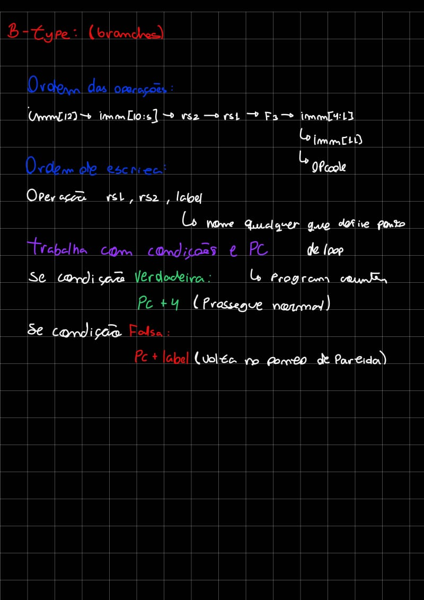

# Introdução a RISC-V

## Formatos de instrução:

### R-Type:
#### Anotações:

#### Instruções comuns do tipo R (RISC-V)

| Instrução | Sintaxe                | Descrição                              |
|-----------|------------------------|----------------------------------------|
| add       | add rd, rs1, rs2       | rd = rs1 + rs2                         |
| sub       | sub rd, rs1, rs2       | rd = rs1 - rs2                         |
| and       | and rd, rs1, rs2       | rd = rs1 & rs2 (AND bit a bit)         |
| or        | or rd, rs1, rs2        | rd = rs1 \| rs2 (OR bit a bit)         |
| xor       | xor rd, rs1, rs2       | rd = rs1 ^ rs2 (XOR bit a bit)         |
| sll       | sll rd, rs1, rs2       | rd = rs1 << rs2 (shift lógico esq.)    |
| srl       | srl rd, rs1, rs2       | rd = rs1 >> rs2 (shift lógico dir.)    |
| sra       | sra rd, rs1, rs2       | rd = rs1 >> rs2 (shift aritmético dir.)|
| slt       | slt rd, rs1, rs2       | rd = (rs1 < rs2)? 1 : 0 (signed)       |
| sltu      | sltu rd, rs1, rs2      | rd = (rs1 < rs2)? 1 : 0 (unsigned)     |

---

### I-Type:
#### Anotações:

#### Instruções comuns do tipo I (RISC-V)

| Instrução | Sintaxe               | Descrição                                          |
|-----------|-----------------------|----------------------------------------------------|
| addi      | addi rd, rs1, imm     | rd = rs1 + imediato                                |
| andi      | andi rd, rs1, imm     | rd = rs1 & imediato                                |
| ori       | ori rd, rs1, imm      | rd = rs1 \| imediato                               |
| xori      | xori rd, rs1, imm     | rd = rs1 ^ imediato                                |
| slti      | slti rd, rs1, imm     | rd = (rs1 < imediato)? 1 : 0 (signed)              |
| sltiu     | sltiu rd, rs1, imm    | rd = (rs1 < imediato)? 1 : 0 (unsigned)            |
| slli      | slli rd, rs1, shamt   | rd = rs1 << shamt (shift lógico à esquerda)        |
| srli      | srli rd, rs1, shamt   | rd = rs1 >> shamt (shift lógico à direita)         |
| srai      | srai rd, rs1, shamt   | rd = rs1 >> shamt (shift aritmético à direita)     |
| lw        | lw rd, offset(rs1)    | rd = Mem[rs1 + offset] (carrega word da memória)   |
| jalr      | jalr rd, rs1, offset  | Jump para (rs1 + offset), salva PC+4 em rd         |

---

### S-Type:
#### Anotações:

#### Instruções comuns do tipo S (RISC-V)

| Instrução | Sintaxe              | Descrição                                                       |
|-----------|----------------------|-----------------------------------------------------------------|
| sb        | sb rs2, offset(rs1)  | Mem[rs1 + offset] = (rs2 & 0xFF)    → armazena 1 byte           |
| sh        | sh rs2, offset(rs1)  | Mem[rs1 + offset] = (rs2 & 0xFFFF)  → armazena 2 bytes (half)   |
| sw        | sw rs2, offset(rs1)  | Mem[rs1 + offset] = rs2             → armazena 4 bytes (word)   |

---

### B-Type:
#### Anotações:

#### Instruções comuns do tipo S (RISC-V)

| Instrução | Sintaxe              | Descrição                                          |
| --------- | -------------------- | -------------------------------------------------- |
| beq       | beq rs1, rs2, label  | Se (rs1 == rs2), então PC = PC + offset            |
| bne       | bne rs1, rs2, label  | Se (rs1 != rs2), então PC = PC + offset            |
| blt       | blt rs1, rs2, label  | Se (rs1 < rs2), então PC = PC + offset  (signed)   |
| bge       | bge rs1, rs2, label  | Se (rs1 >= rs2), então PC = PC + offset (signed)   |
| bltu      | bltu rs1, rs2, label | Se (rs1 < rs2), então PC = PC + offset  (unsigned) |
| bgeu      | bgeu rs1, rs2, label | Se (rs1 >= rs2), então PC = PC + offset (unsigned) |

### U-Type:
#### Anotações:

#### Instruções comuns do tipo U (RISC-V)

| Instrução | Sintaxe          | Efeito             | Uso típico                               |
|-----------|------------------|--------------------|------------------------------------------|
| lui       | lui rd, imm20    | rd = (imm20 << 12) | Carregar parte alta de um imediato       |
| auipc     | auipc rd, imm20  | rd = PC + (imm20 << 12)| Endereço relativo ao PC (PC-relative)    |

### J-Type:
#### Anotações:

#### Instrução principal do tipo j (RISC-V)

| Instrução | Sintaxe       | Descrição                                                            |
| --------- | ------------- | -------------------------------------------------------------------- |
| jal       | jal rd, label | rd = PC + 4; PC = PC + offset (offset relativo ao label, até ±1 MiB) |

